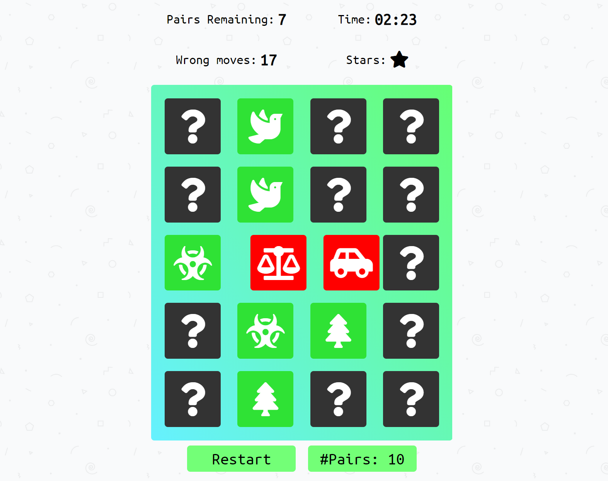

# In-browser memory game

I build this simple memory game to gain and demonstrate basic proficiency with HTML/Javascript. The game sets out a deck of face-down cards before the player, and the player repeatedly choses two cards to flip over, aiming to find all the pairs as quickly as possible without making too many incorrect guesses.

## Running the game

The easiest way to play this game is to open [this link](http://x4vier.github.io/) in your web-browser (it should work on both desktop and mobile). Alternatively, you can play the game by downloading and decompressing all the files, and then opening ```index.html``` in your web browser of choice. *Warning*: In some web browsers, some text may be slightly misaligned.

## How to play

When you click or tap on a card, the card will flip over, revealing the symbol hidden on the other side. Your goal as the player is to find pairs of cards with matching symbols. Once you've found a match those cards will turn green and remain face-up. When you have paired every card up with its matching counterpart, you win! The awards you either 1, 2 or 3 stars at the end, depending on how quickly you finish the game, and how few incorrect guesses you made in the process.

To start the game over, click the ```Restart``` button at the bottom of the page. If you would like to change the number of cards in the deck, click the ```#Pairs``` button and select the desired number from the dropdown menu, before clicking ```Restart```.



## Game Features

- **Responsive design** - elements resize themselves to fit inside the window. The game automatically adjusts the number of card-columns to use based on the size of the deck and the size of the display.
- **Random layout** - every game uses a different set of symbols, arranged in a different way.
- **Customizable difficulty** - The user is able to select what size of grid they want to play with.
- **Animation** - CSS animations are employed to make the game more attractive and intuitive.

## Project Dependencies

- [Font Awesome](https://origin.fontawesome.com/) (will be downloaded automatically when you run the app).
- [Google fonts](https://fonts.google.com/) (will be downloaded automatically when you run the app).

## Acknowledgments

- The background image was made by *Tori Pantha*, downloaded from *Subtle Patterns* [link here](https://www.toptal.com/designers/subtlepatterns/geometry-2/).
- The game mechanics and aesthetics were inspired by a template by *Udacity* [link here](https://github.com/udacity/fend-project-memory-game). (Note: while I took inspiration from their design, I wrote all the code for this project myself from scratch).